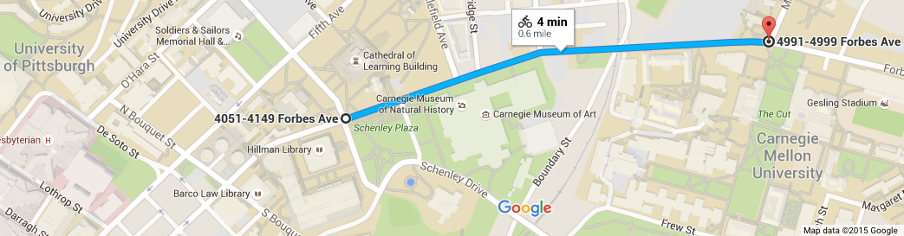
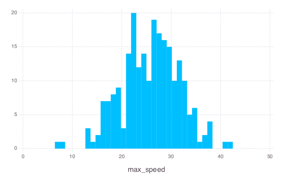

# Geurilla traffic speed monitoring to inform and push for change

#### *(or: using open source software and readily available tools to see how fast traffic moves on Forbes Ave)*

October was a tragic month for the Oakland community in Pittsburgh.  Two pedestrians and a cyclist were killed in car crashes within four days of each other. While the collisions are still under investigation, I have a strong suspicion that speed was a major factor in both.  The survivability of a crash decreases very dramatically as speed increases from 20 to 40 miles per hour [[1]](http://humantransport.org/sidewalks/SpeedKills.htm).

There's been a number of calls for traffic calming measures along Forbes Avenue, which is one of the few routes east for both cars and cyclists.  I was curious what the current average traffic speed is, and if we could strengthen these calls with some real data.  Even though there's no public data and I don't have a RADAR gun, it's possible to collect this myself with just a high vantage point, a cell phone video, and basic computer vision techniques.

The stretch of Forbes Avenue that I'd like to focus on is between Pitt and CMU:

It's here that the road and surrounding area "opens up." The previous 8-10 blocks go through the tightly packed Oakland business district, with timed traffic lights (matching the 25MPH speed limit) at every intersection.  Once you reach Schenley Plaza, though, the buildings recede away and there's a sense of freedom.  I also believe that the timings of lights change at this point, too, allowing you to exceed 25MPH for the first time since the highway exit.  Once you get to the Natural History museum, a fourth travel lane is added on the left and the right lane turns into an unmarked 20ft wide luxury lane.  The right side of this lane is intended as a bus stop, but the lack of markings makes it a bit of a free-for-all when there aren't any busses.  I believe that all these things contribute to an overall increase in speed.

I don't have a RADAR gun, but I do have a cell phone and access to the Cathedral of Learning.  At about 3:15pm on Friday afternoon, I recorded 10 minutes of traffic on Forbes Ave. The full movie is [available on YouTube](https://youtu.be/R8jttmhTTUE). Here's a snippet of what this looked like:

You can see Dippy the Dino on the top left, with Schenley Plaza on the top right, and the intersection with Schenley Drive Extension in between.  Unfortunately the trees obscure the section of the road where I think traffic moves the fastest, but there's a great view of about 300ft of the road.  I rotated and cropped the image, used basic image processing techniques to detect objects and their locations, converted pixels to real distances, and computed their speeds. The full analysis is documented in the [IJulia/Jupyter notebook within this repository](TrafficSpeed.ipynb) as a mini-tutorial. It worked surprisingly well:

Now we can see how fast traffic can move! See the [full ten minutes of annotated traffic at YouTube](https://youtu.be/jwVxQ7OcNyk). I've exported the detected positions of all the cars as a CSV file.  Here's the maximum speeds of all vehicles which got tracked for more than two seconds:

Two cars were caught going over 40 miles per hour in this 25MPH zone.  And ten others were between 35-40 miles per hour.  If any of these cars happen to hit a pedestrian or cyclist, regardless of the fault, there is a significantly greater chance of serious harm or death than if they were following the speed limit.  This is strong evidence that the university and city needs to work harder at reducing speeds throughout this busy corridor to keep students, pedestrians, cyclists, and drivers alike safe.  Working towards comprehensive solutions over the next two to three years is a great goal, but there are small steps that the city and university can take *today* to make this street a safer place. I think a great first step will be to increase speed awareness with more signs and enforcement.
